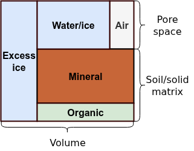

# Soil stratigraphy

```@meta
CurrentModule = Terrarium
```

!!! warning
    This page is a work in progress. If you have any questions or notice any errors, please [raise an issue](https://github.com/NumericalEarth/Terrarium.jl/issues).

## Overview

### Soil composition and material properties

The subsurface soil column consists of multiple material constituents that determine its physical and chemical properties. These constituents include water and ice occupying the pore space, air filling unsaturated pores, and a solid matrix composed of mineral and organic material. To accurately represent many soil processes in land surface models, it is necessary to characterize both the lateral and vertical distribution of each soil constituent along with its relevant material properties.

The *stratigraphy* of a soil column defines its vertical layering structure both in terms of texture as well as other properties. Soil texture refers to the relative proportions of sand, silt, and clay in the mineral soil component. Textures are characterized by their particle size distribution, which is a fundamental property affecting hydraulic conductivity, water retention, and thermal properties.

The total void space available in a soil volume controls the maximum amount of water and air that can occupy the pore space. The ratio of void space to the total soil volume is called *porosity*. Porosity varies depending on soil type, bulk density, and the presence of organic material. Organic soil components typically have higher porosity than mineral soil due to their loose, aggregated structure.

### Soil volume composition

An elementary volume $V$ of soil can be represented as the sum of the volume of solid material and void space (soil pores),
```math
\begin{equation}
V = V_{\text{por}} + V_{\text{solid}} = \overbrace{V_{\text{liq}} + V_{\text{ice}} + V_{\text{air}}}^{\text{pore constituents}} + \overbrace{V_{\text{min}} + V_{\text{org}}}^{\text{solid constituents}}\,.
\end{equation}
```
$V_{\text{liq}}$ and $V_{\text{ice}}$ correspond to the liquid and ice phases of water and ice stored in the pore space while $V_{\text{air}}$ is residual air in unsaturated conditions; $V_{\text{min}}$ and $V_{\text{org}}$ are the mineral and organic solid constituents respectively. Note that the air is here assumed to be a constant mixture of gases and thus changes in the gas phase of water are neglected.

For many physical calculations depending on soil composition, it is more convenient to work directly with volume-invariant (intensive) quantities such as *volumetric* (m³/m³) or *characteristic* fractions such as **porosity** $\phi = \frac{V_{\text{por}}}{V}$, **saturation** of pore water/ice $\xi = \frac{V_{\text{liq}} + V_{\text{ice}}}{V_{\text{por}}}$, **liquid water fraction** $\ell = \frac{V_{\text{liq}}}{V_{\text{liq}} + V_{\text{ice}}}$, and the **organic** fraction of solid material $\omega = \frac{V_{\text{org}}}{V_{\text{solid}}}$. In permafrost environments, an additional characteristic fraction for excess or segregated ground ice is sometimes included. This is, however, currently neglected in Terrarium.



The total volumetric fractions of each component can then be trivially derived from the characteristic fractions:

```math
\begin{align*}
\theta_{\text{liq}} &= \ell \xi \phi\,,\\
\theta_{\text{ice}} &= (1 - \ell) \xi \phi \,,\\
\theta_{\text{air}} &= (1 - \xi) \phi\,,\\
\theta_{\text{org}} &= \omega (1 - \phi) \,,\\
\theta_{\text{min}} &= (1 - \omega) (1 - \phi)\,,\\
1 = \theta_{\text{liq}} + \theta_{\text{ice}} + \theta_{\text{air}} + \theta_{\text{org}} + \theta_{\text{min}}
\end{align*}
```

## Stratigraphy types

### Homogeneous stratigraphy

```@docs; canonical = false
HomogeneousStratigraphy
```

## Soil texture

```@docs; canonical = false
SoilTexture
```

## Soil porosity

```@docs; canonical = false
ConstantSoilPorosity
```

```@docs; canonical = false
SoilPorositySURFEX
```

## Soil volume

```@docs; canonical = false
SoilVolume
```

## Solid matrix

```@docs; canonical = false
MineralOrganic
```

## Methods

```@docs; canonical = false
soil_texture
```

```@docs; canonical = false
soil_matrix
```

```@docs; canonical = false
soil_volume
```

```@docs; canonical = false
mineral_porosity
```

```@docs; canonical = false
organic_porosity
```

```@docs; canonical = false
volumetric_fractions
```

## Kernel functions

```@docs; canonical = false
organic_fraction
```

```@docs; canonical = false
porosity
```
